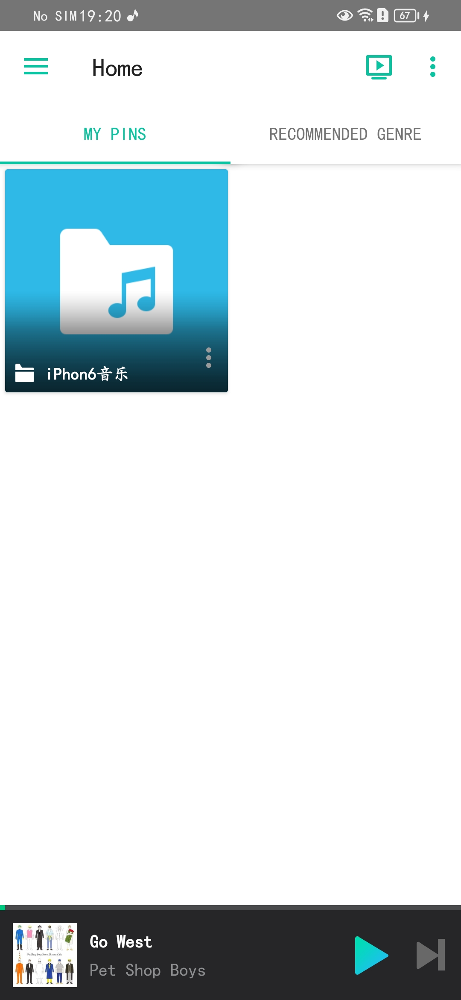
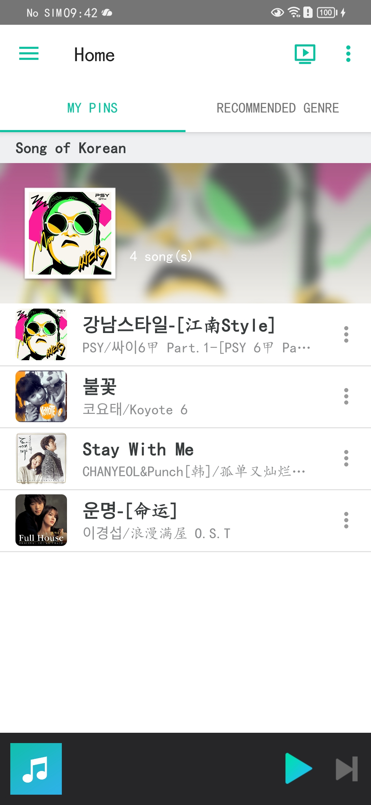
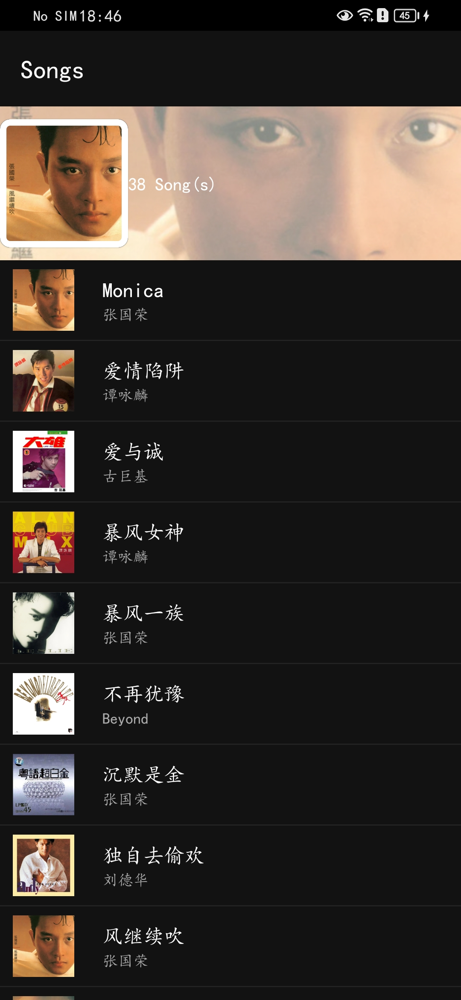
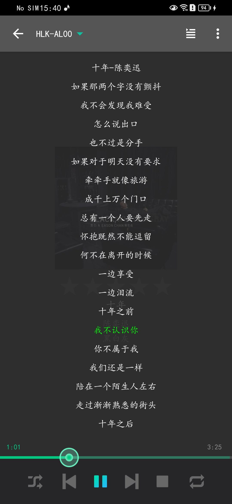

<div align="center">
<h1>🎵 DS Player</h1>
<h2>A modern Synology NAS music player inspired by DS Audio</h2>
<i>Rebuilt, restored, and improved for Android</i>
<p>
  
  
  
  
  
</p>
</div>

## ✨ About

DS Player is an Android music player for **Synology NAS**, inspired by **DS Audio**.

This project started from my personal interest in improving the original DS Audio experience, especially the **lyrics UI and playback interaction**.

It is based on restoring and reorganizing the original **DS Audio architecture**, while keeping compatibility with its framework structure such as:

- `DaggerFragment`
- `DaggerDialogFragment`
- Synology NAS API
- DS Audio style navigation and player logic

The original motivation was simple:

> 🎯 Make lyrics scrolling and seeking better than DS Audio

## 🖼️ Screenshots

<table>
<tr>
<td align="center">
<br/>
<b>Home Page</b>
</td>
<td align="center">
<br/>
<b>Playlist</b>
</td>
<td align="center">
<br/>
<b>Playlist2</b>
</td>
<td align="center">
<br/>
<b>Lyrics</b>
</td>
</tr>
</table>

## 🚀 Features

### 🏠 Main Pages
- HomePageFragment (PinsFragment, DefaultGenreFragment)
- PlaylistFragment
- RadioFragment
- FileSongFragment
- PlayerFragment (LyricFragment(PhoneLyricFragment、TabletFragment)、PlayingQueueFragment)
- TestFragment

---

### 🎵 Music Browsing
- browse NAS music library
- radio support
- genre browsing
- pinned content
- file song list

---

### 🖼️ Improved Album Covers
Originally, every song item used the default icon: `R.drawable.icon_music`

Now each item can load its own cover image using: `CoverUriLoader`

This improvement was implemented by modifying: `FileSongListAdapter`

---

### 🎤 Better Lyrics Experience
This is the most important improvement target of the project.

Current test features:

- smooth lyric scrolling
- draggable lyric seek
- synchronized playback progress
- LyricViewX integration testing

Currently tested in:

```text
PlayerActivity
```

Future versions will replace the default DS Audio lyrics UI completely.

---

## 🛠️ Tech Stack

- Android
- Java / Kotlin
- Dagger
- Fragment architecture
- Synology NAS API

---

## 🧪 Test / Debug Pages

### 🔍 TestFragment、MyPinsFragment、GenreFragment

Used for testing:

- `queryAll()` NAS API methods、endpoint information、debugging response structures
- switch fragment

---

## 📍 Current Progress

Most core functions are already working.

### ✅ Completed
- [x] homepage
- [x] player page
- [x] lyric fragment
- [x] file song list
- [x] radio
- [x] song list page
- [x] player activity lyric tests
- [x] album cover loading

---

### 🚧 In Progress
- [ ] SearchActivity
- [ ] secondary menu actions
- [x] fragment back stack optimization
- [x] lyric UI replacement

---

## 🐞 Known Issues

Some incomplete logic still exist.

### 🧩 Missing Features
Some secondary menu operations are not yet completed:

- [ ] Download
- [ ] Rate
- [ ] Playlist operations
- [ ] Share

---

## 🗺️ Roadmap

### 🎯 Near Future
- [x] replace default lyric UI with **LyricViewX**
- [x] fix back gesture issues
- [ ] improve search entrance UX & complete SearchActivity

---

### 🌟 Future Improvements
- [ ] dark mode optimization
- [ ] better player animations
- [ ] better NAS API abstraction

---

## 💡 Why This Project

The original DS Audio app works well, but I always felt two areas needed improvement:

### 🎤 Lyrics
The default lyrics experience is not smooth enough.

Especially:
- scrolling
- dragging
- syncing

---

### 🔍 Search
The search button location is inconvenient.

Currently users need to:

```text
return to root page → open drawer → click search
```

This should be much easier.

---

## 📜 License

This project is licensed under a **Non-Commercial License**.

🚫 Commercial use is not allowed.

See [LICENSE](LICENSE) for details.

---

## ⚠️ Disclaimer

This project is for **personal learning and development purposes only**.

It is inspired by Synology DS Audio and is **not affiliated with Synology**.
